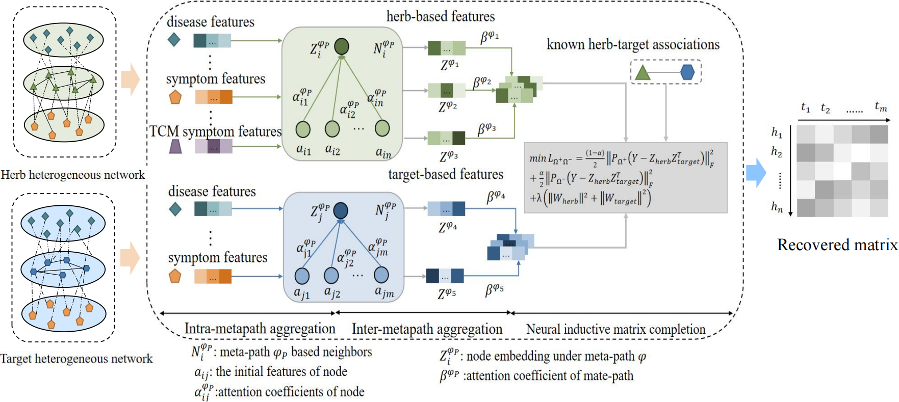
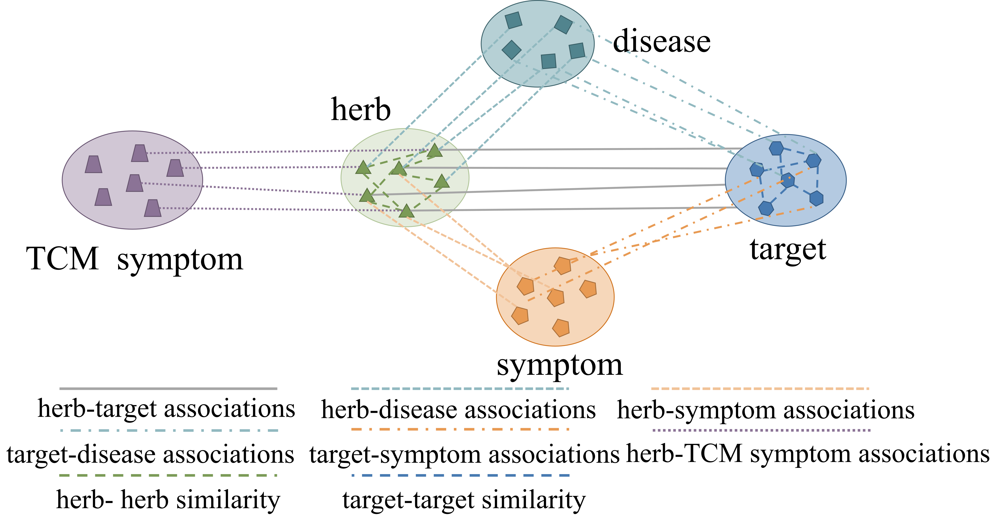
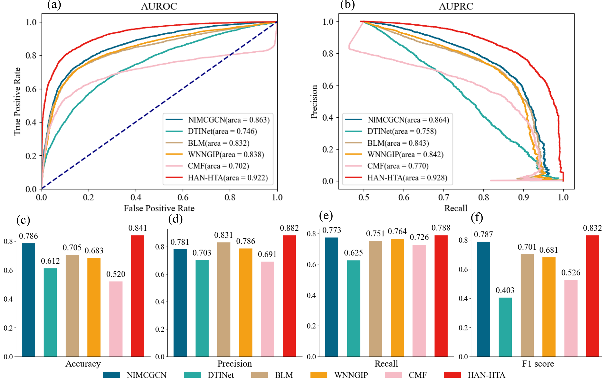
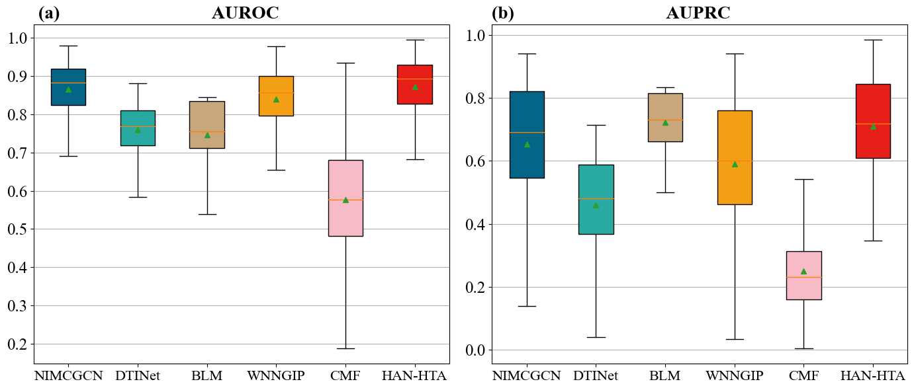
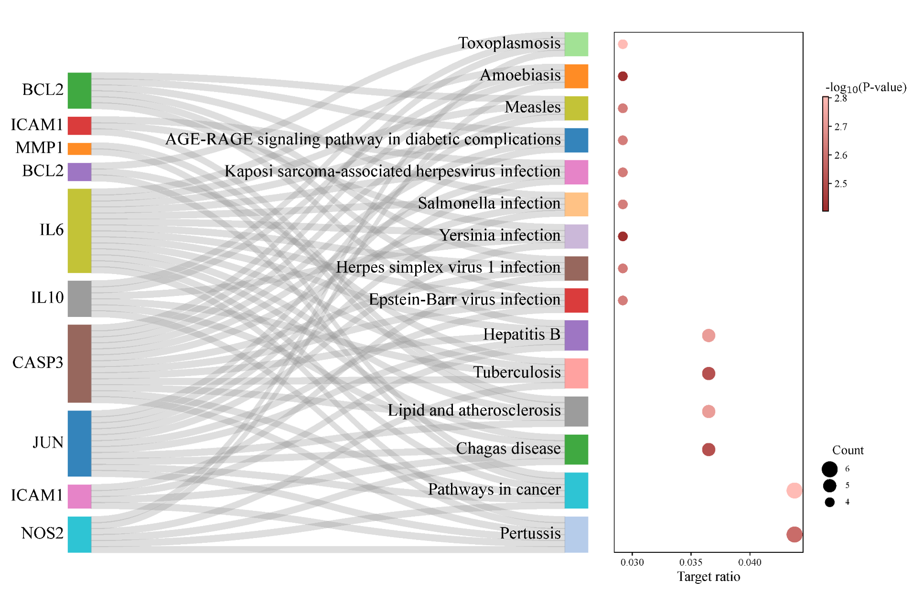

# HAN-HTA: Herb-Target Association Prediction Using a Heterogeneous Attention Network

This repository provides the implementation and preprocessed data of **HAN-HTA**, a deep learning framework for herb-target association prediction in Traditional Chinese Medicine (TCM).

HAN-HTA combines a **heterogeneous graph attention network** with **neural inductive matrix completion** to learn herb and target representations from heterogeneous biomedical information and predict herb-target associations.

> **Paper:** *Herb target prediction based on neural inductive matrix completion with heterogeneous graph network*

## Overview

The overall architecture of HAN-HTA is illustrated below.

<p align="center">
  
</p>

HAN-HTA performs intra-meta-path and inter-meta-path aggregation to obtain herb and target embeddings, followed by neural inductive matrix completion for herb-target association prediction.

## Dataset

The **Zdataset** integrates heterogeneous information from multiple biomedical and TCM databases, including SymMap, ETCM, HERB, SIDER, and DrugBank.

The heterogeneous network contains **4,584 nodes and 200,750 edges**, including 318 herbs, 895 targets, and eight relationship types.

| File | Relationship |
|---|---|
| `herb_herb.csv` | Herb-herb similarity |
| `herb_disease.csv` | Herb-disease associations |
| `herb_TCMsymptom.csv` | Herb-TCM symptom associations |
| `herb_symptom.csv` | Herb-symptom associations |
| `target_drug.csv` | Target-drug associations |
| `target_disease.csv` | Target-disease associations |
| `target_symptom.csv` | Target-symptom associations |
| `target_herb.csv` | Herb-target associations |

## Heterogeneous Graph Construction

The heterogeneous network integrates herb-, target-, disease-, symptom-, and TCM symptom-related information through multiple semantic relationships and meta-paths.

<p align="center">
  
</p>

## Training and Evaluation

HAN-HTA is evaluated using **10-fold cross-validation**. In each fold, training herb-target associations are used for model learning, while held-out associations are reserved for evaluation.

The model is evaluated using:

- AUROC
- AUPRC
- Accuracy
- Precision
- Recall
- F1-score

The implementation also supports new-target prediction for a given herb.

## Results

HAN-HTA achieves the best performance among the compared methods on the Zdataset. The reported AUROC and AUPRC are **0.922** and **0.928**, respectively.

<p align="center">
  
</p>

For the given-herb prediction experiment, HAN-HTA achieves an average **AUROC of 0.889** and **AUPRC of 0.718**.

<p align="center">
  
</p>


## Case Studies

HAN-HTA was further applied to candidate target prediction for **Artemisia annua (Qinghao)** and **Ginkgo biloba (Yinxing)**. The top-ranked candidate targets were further examined using literature evidence and pathway/GO enrichment analysis.

<p align="center">
  
</p>

## Repository Structure

```text
.
├── dataset/
│   └── Zdataset/
├── figures/
│   ├── figure1_overview.png
│   ├── figure2_heterogeneous_network.png
│   ├── figure3_performance.png
│   ├── figure4_given_herbs.png
│   └── figure5_case_study.png
├── main.py
├── model.py
├── utils.py
├── predict_new_target.py
└── README.md
```

## Usage

### Train HAN-HTA

```bash
python main.py
```

### New-target prediction

```bash
python predict_new_target.py
```

Dataset paths and experimental parameters can be configured in the corresponding scripts.

## Baselines

The baseline methods were implemented according to their original publications. Their original architectures and parameter settings were retained, with the input data adapted to the herb-target prediction task using the Zdataset.

## Requirements

- Python
- PyTorch
- DGL
- NumPy
- Pandas
- SciPy
- scikit-learn

## Citation

If you use this code or dataset, please cite:

> *Herb target prediction based on neural inductive matrix completion with heterogeneous graph network.*

## Contact

For questions regarding the implementation or dataset, please contact the corresponding author.
